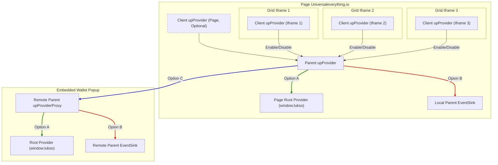
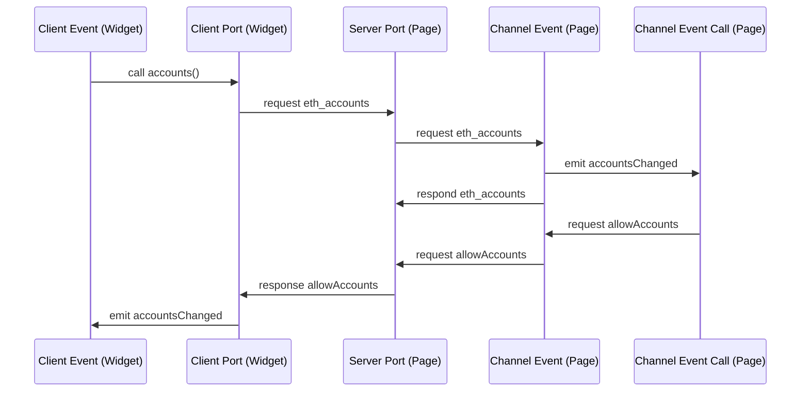

# tools-lukso-provider

Here is a small diagram to show how the client and providers (servers) talk to each other. The upProviderProxy needs pretty much 100% of the functionality the Parent upProvider needs because it also has the connectivity endpoints.

# sample path

